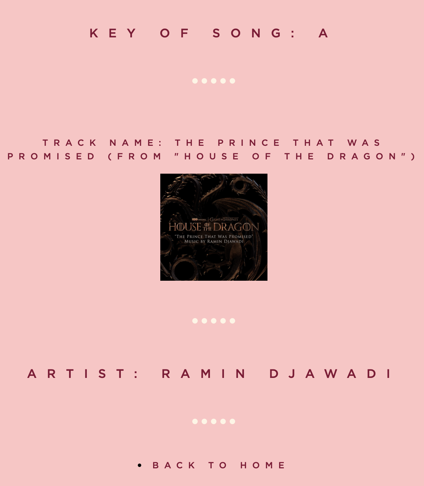

useless backstory: i've made countless playlists and so to shake things up i decided that this year i'll make another playlist BUT every song must be adjacent to at least one other song that is in the same key. I thought, 'ah easy'. Then i soon realised that I have the musical ears of a donkey and had to keep going to my piano to work out the key of every other song.

THE SOLUTION (kind of):

a mini project that uses spotipy to access the spotify API to get information about the musical key of any song
rendered to a basic UI using flask

the main page is called 'get song key' --> input the spotify url of the track to get its key
the second page is called 'get song keys of entire playlist' (terrible name i know) --> input the playlist url to get every song in the playlist ordered by its key

additional features i want to add:

- after searching for a song: display other popular songs that are in the same key (mild)
- search by key (lite): once user enters a key, look through all the most popular songs and get songs in that key
- after searching for a song: display other popular songs that i may like that are in the same key (would require using more specific data) (hot)

command:
`flask run`

